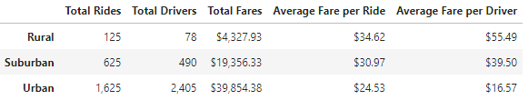
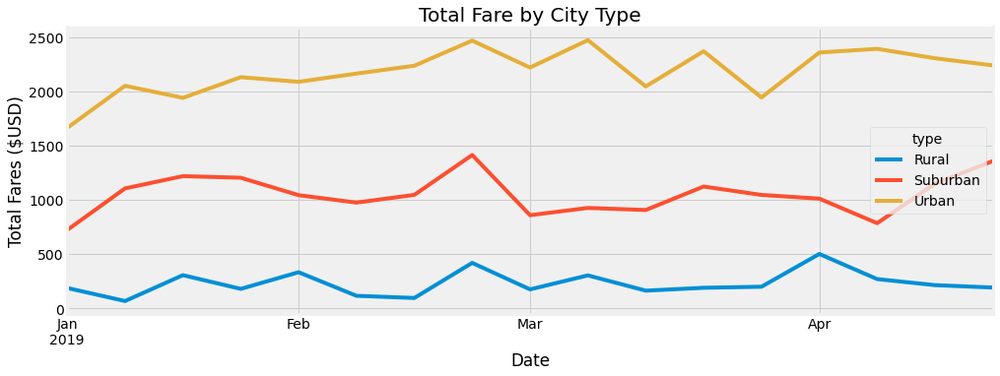
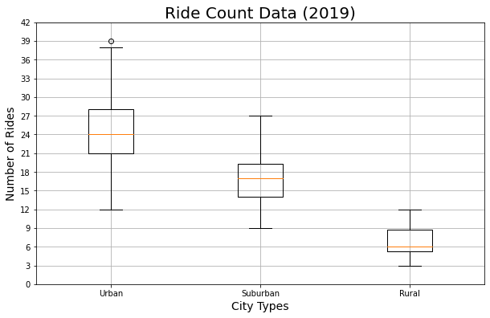
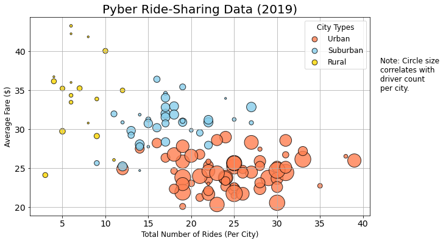
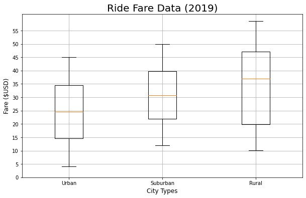

# Analysis of Ridesharing Fares by City Size

## Project Overview

This repository contains multiple scripts designed for the anlysis19 ridesharing data.  

The intent of the analysis is to segment ridesharing data by city type, using ride data from the first third of the year 2019.  Each city is categorized as either Urban, Suburban, or Rural based on the size of the city, and each city's full set of logged rides for those four months are aggregated in order to determine metrics and suggest potential business policy changes for the company.

## Resources
* Anaconda3 (2021.11)
* Jupyter Lab (3.2.1)
* Python (3.7.11), with the following modules:
    * pandas (1.3.4)
    * numpy (1.20.3)
    * citiPy (0.0.5)
    * matplotlib (3.4.3)
    * requests (2.26.0)
* Visual Studio Code (1.63.2)

## The Data

* `city_data.csv`
    * Data for each city location for a specific ride **is this departing or arriving?**
    * Total records: 120
    * Columns:
        * City
        * Driver Count
        * City Type (Urban/Suburban/Rural)

* `ride_data.csv`
    * List of rides booked during the time period
    * Total records: 2375
    * Columns:
        * City
        * Date (timestamp of ride)
        * Fare ($USD)
        * ride_id (unused in analysis)

## Analysis

The analysis demonstrates, as might be expected, that the vast majority of rides are within urban areas.

Total fare by city type, with our limited sample data set, shows limited potential seasonality (save for a spike in all city types in late February).  Weekly total urban fares are roughly $2,000-2,500 per week, meaning that urban areas earn as much in fares over two weeks as urban areas did in the whole four-plus months of the data sample.

Average number of drivers based on city type is fairly consistent, with the median urban area containing four times as many drivers as rural areas, **what about suburban??**

Look at this.  Volume of rides on individual cities.  **How does this contextualize rest of analysis?**

Rural average prices are higher than other city types, but with a much wider distribution.  **Median(?)** fares in rural cities are roughly 40% higher **(verify me!)**

## Challenges

Chart transparency was a personal challenge due to the fringes of the picture being listed as transparent. **MAKE A PICTURE HERE TO SHOW THE ISSUES?**  Images using default savefig rendered ineffectively, with transparent edges (given the prevalence of darkmode, including on my own computer, this is an issue).  facecolor='white', transparent=False, bbox_inches="tight"

## Business Recommendations

* Hire more drivers in rural areas.  Average wages per driver are highly variable, but on average high.  Consider promoting this fact in advertising campaigns targeted to potential rural drivers.

* What about the suburbs?  Any recommendations?

* Consider disparate causes/patterns among rides.  Rural rides likely more expensive on average due to longer trips.
    * Are the typical rides *inter*city rides or *intra*city rides?  Obtaining that data would help further contextualize disparities between urban and rural modes. (few ride opportunities available in individual cities)
    * Consider this as a different sort of marketing campaign for individual riders.  Ridesharing is often perceived as an option for short trips specifically, but in low-density areas can provide a vital intercity transit option.

* Consider supply/demand curve in urban areas.  Driver volume is significantly higher.  Does this impact overall wages per driver?  Does this impact rider experience?

* Pursue other data harvesting and analysis opportunities to further understand market dynamics:
    * How long is each trip, both in distance and time?
    * How many rides per day/week are being performed per driver (would require unique driver ID on ride data)?
    * How does the number of drivers change over time?
    * Per capita population analysis -- Integrate other information about specific cities to understand if there are too many/few drivers.
    * Correlations with availability of other transit options?
    * Price of maintenance etc for regions?