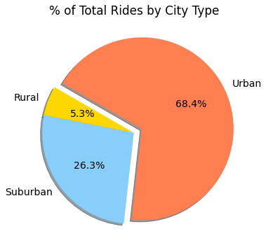
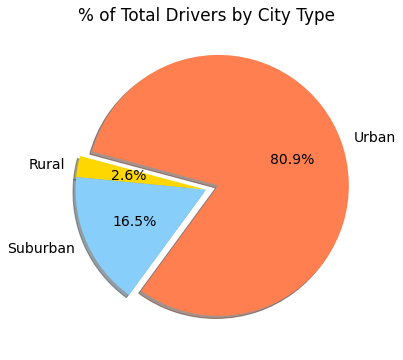

# Analysis of Ridesharing Fares by City Size

## Project Overview

This repository contains multiple scripts designed for the analysis of ridesharing business data.  

The intent of the analysis is to segment data by city type, using ride data from the first third of the year 2019.  Each city is categorized as either Urban, Suburban, or Rural based on the size of the city, and each city's full set of logged rides for those four months are aggregated in order to determine metrics and suggest potential business policy changes for the company.

## Resources
* Anaconda3 (2021.11)
* Jupyter Lab (3.2.1)
* Python (3.7.11), with the following modules:
    * pandas (1.3.4)
    * numpy (1.20.3)
    * citiPy (0.0.5)
    * matplotlib (3.4.3)
    * requests (2.26.0)
* Visual Studio Code (1.63.2)

## The Data

* `city_data.csv`
    * Data for each city location for a specific ride
    * Total records: 120
    * Columns:
        * City
        * Driver Count
        * City Type (Urban/Suburban/Rural)

* `ride_data.csv`
    * List of rides booked during the time period
    * Total records: 2375
    * Columns:
        * City
        * Date (timestamp of ride)
        * Fare ($USD)
        * ride_id (unused in analysis)

## The Code

* `Pyber.ipynb` -- Contains majority of initial exploratory data analysis, including:
    * Summary statistics, including box and whisker plots for driver count, ride count, and fare (Figs 2-4).  
    * Built bubble scatterplot for ridesharing volume (see Fig 1 below).  
    * Pie charts for total city type volume (Figs 5-7).

* `Pyber_challenge.ipynb` -- Contains total fare by city type time-series line chart and DataFrame displayed below (Figs 8-9).

## Analysis

The analysis demonstrates, as might be expected, that the vast majority of rides are within urban areas.

Total fare by city type, with our limited sample data set, shows limited potential seasonality (save for a spike in all city types in late February).  Weekly total urban fares are roughly $2,000-2,500 per week, meaning that urban areas earn as much in fares over two weeks as rural areas did in the whole four-plus months of the data sample.

Average number of drivers based on city type is fairly consistent, with the median urban area containing four times as many drivers as rural areas, with suburban areas unsurprisingly sitting somewhere in between.

Urban drivers seem to disproportionately represent the total fleet compared to average ride volume, with 80.9% of drivers but only 68.4% of total rides.

Rural average prices are higher than other city types, but with a much wider distribution.  Median fares in rural cities are roughly 40% higher than in urban areas.

The disparity in ride volume vs average fare is demonstrated in the plot below, with rural areas demonstrating much higher fare volme.

## Challenges

Chart transparency was a challenge due to the borders of each generated chart imagee being listed as transparent when using the default values in the `matplotlib.pyplot.savefig()` method.  Given the prevalence of dark mode, including on my own computer, transparency in each figure would result in illegible x- and y-axis values and labels.  This issue was resolved by using the following parameters in the 

`facecolor='white', transparent=False, bbox_inches="tight"`

## Business Recommendations

* *Hire more drivers in rural areas.*  Average wages per driver per rural city are highly variable, but on average higher than other city types.  Consider promoting this fact in advertising campaigns targeted to potential rural drivers.

* *Further analysis of disparate causes/patterns among rural rides.*

    * What is the cause of the higher variability in average fare per city in rural areas?  Root cause identification may help better understand rural city market.
    * Are the typical rides *inter*city rides or *intra*city rides?  Analyzing location data for start and end of the ride would help further contextualize disparities between urban and rural modes.
    * Consider this a different sort of marketing campaign for individual riders.  Ridesharing is often perceived as an option for short trips specifically, but in low-density areas can provide a vital intercity transit option.

* *Consider supply/demand curve in urban areas.*  Driver volume is significantly higher in urban areas, resulting in lower fares on average for each individual driver.  Does this impact overall wages per driver?  Does this impact rider experience?

* *Additional data harvesting.*  Pursue other data opportunities to further understand market dynamics, and attempt to answer the following questions:
    * How long is each trip, both in distance and time?
    * How many rides per day/week are being performed per driver?
    * How does the number of drivers change over time?  How is this impacted by the fares they receive?
    * Per capita population analysis: How does the amoutn of drivers per person in a given city affect fares and ride frequency?
    * How does ride frequency and fare size change with availability of other with availability of other transit options in a given city?